# Whiff Cannon 4000
Odor Gun tribute

♫ This is not the greatest olfactometer in the world, no. This is just a tribute ♫ [to [Burton et al, 2019](https://pubmed.ncbi.nlm.nih.gov/30657873)]. [#Tribute](https://www.youtube.com/watch?v=_lK4cX5xGiQ)
We were inspired to build this after Matt Wachowiak’s presentation at ECRO 2025. 

The logic of the olfactometer’s operation is detailed in [the original paper](https://pubmed.ncbi.nlm.nih.gov/30657873).  
This page details the following:
1) Our [Modifications](#Modifications)
2) The 3D print files for our [custom parts](#custom-parts) 
3) Off the shelf [parts list](#off-the-shelf-parts-list)
4) Jupyter notebook based **[software](#Software) to control the olfactometer**, including outputting the timing and valve that was actuated, triggering of other devices and recording of signals (e.g. PID alongside valve timings)
5) [Calibration data](#Calibrations) or our assembled device

The building and testing of this olfactometer was carried out primarily by Georgina Bonny, Adam Barrett and Shreya Choudhuri.

## Modifications
We have made the following adjustments:

1) Decreased diameter of carrier stream (13.87 mm inner diameter reduced to 5 mm).
2) Increased capacity of odour reservoirs (we were unable to source the original reservoirs in Europe). 

Our delivery barrel was redesigned to account for these differences as shown below.
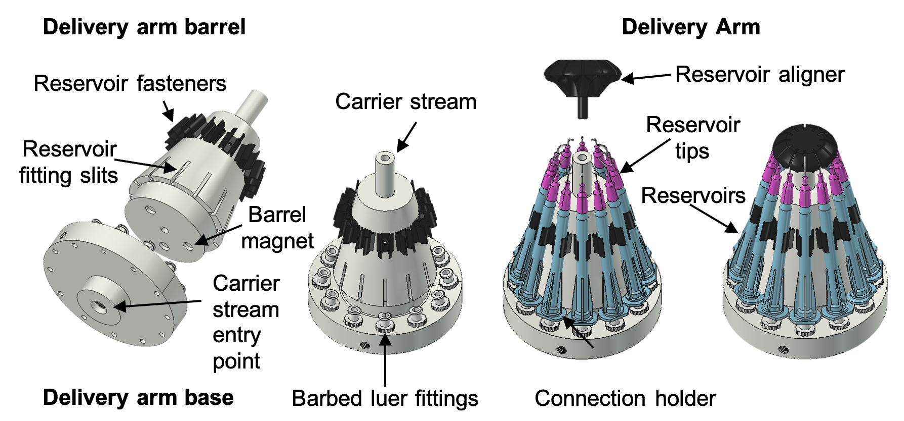
Delivery assembly IRL    
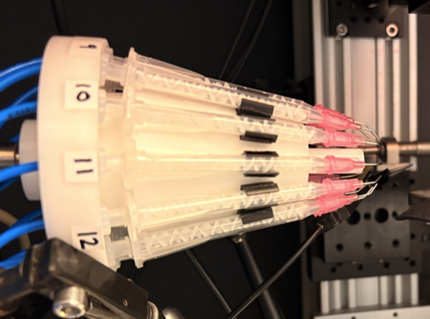

The enclosure housing the solenoid valves and electronics was made from a Thorlabs enclosure.	

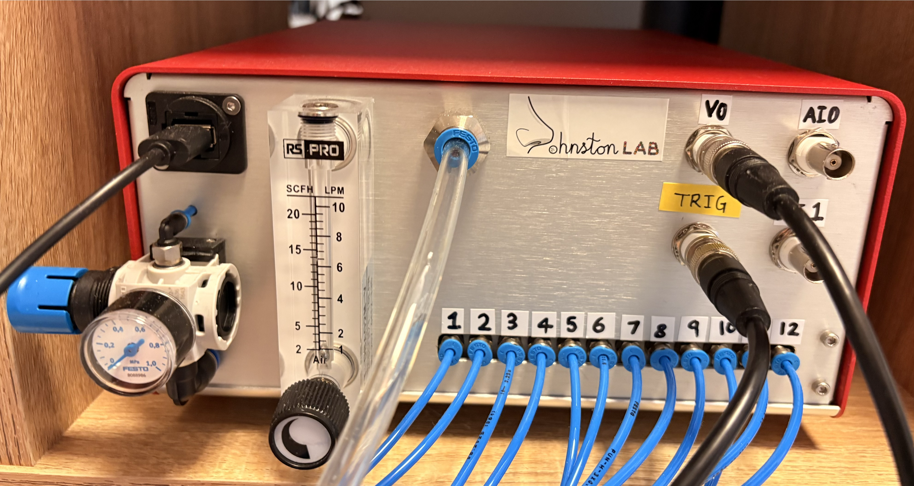
- There are 2 analong inputs (AI0 & AI1) enabling recording of PID and valve actuations
- V0 gives a signal corresponding to valve and carrier stream activity
- Trig provides an output TTL for triggering other equipment

## Custom parts
[We provide 3D print files for the delivery barrel and tip aligner.](https://github.com/JohnstonLab/Whiff-Cannon-4000/tree/main/Custom_parts). The tip aligner ensures the tips are aligned into the narrower carrier stream.

## Off the shelf parts list
[Parts list](off_the_shelf_components.md) for all other components and consumables that may be easier to source for interested Europeans.

## Software
The software is based on our Better Olfactometer Software(s) [BOSS repository](https://github.com/JohnstonLab/BOSs).
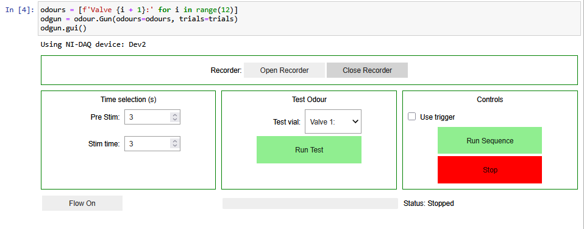
- Time setting box applies only to running a test. You can select a valve from the drop down menu and deliver a single trial by clicking 'Run Test'. 
- 'Flow on' button turns carrier stream on and sets the VO BNC port to 0.5V to indicate that flow is on
- 'Stop' button closes all valves and stops the carrier stream, can interput all other processes.
- 'Use trigger' checkbox will generate a TTL pulse at the start of each 'Pre (s)' period defined in a protocol sequence
- 'Run Sequence' will execute a sequence that has been loaded in the previous cell. Sequences are stored as csv files with the following structure. You can create multiple sequences and load them as necessary. 
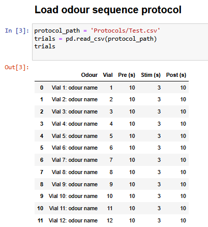
- Open / close Recorder, opens a new floating window to dispaly and record signals from AI0 & AI1. It can be used simmultaneously with the control panel in the jupyter notebook.
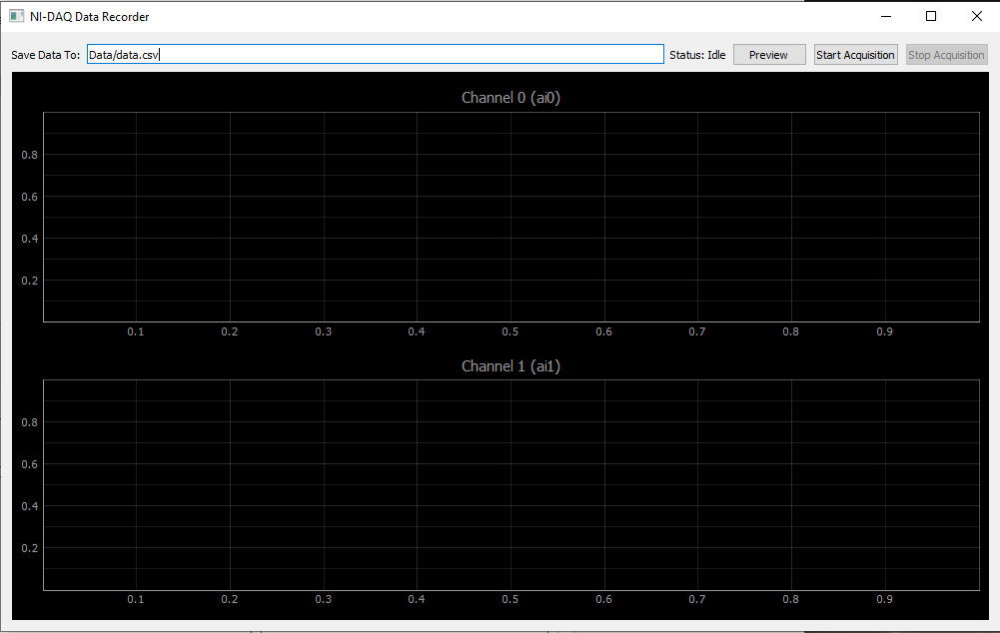

## Calibrations
We routinely use 0.2 MPa for the odour delivery valve pressure and 3 l min -1 for the flow rate of the carrier stream, with the whiff canon 4000 positioned 4 cm from the nose of the subject. 

### Odour pressure 
Varying the odour delivery valve pressure, all measured with the carrier stream set at 3 l min-1. Measured with a miniPID 4 mm from whiff cannon 4000 tip.
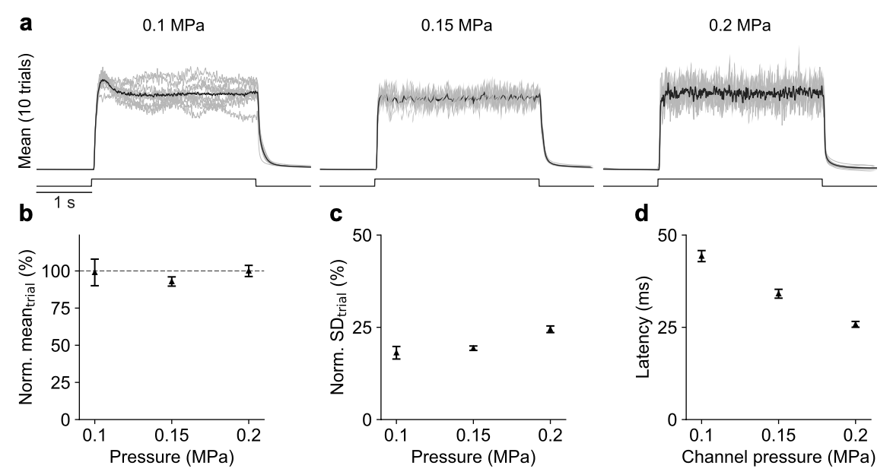
### Carrier flow
Varying flow rate of carrier stream with valve pressure held at 0.2 MPa. Measured with a miniPID 4 mm from whiff cannon 4000 tip.
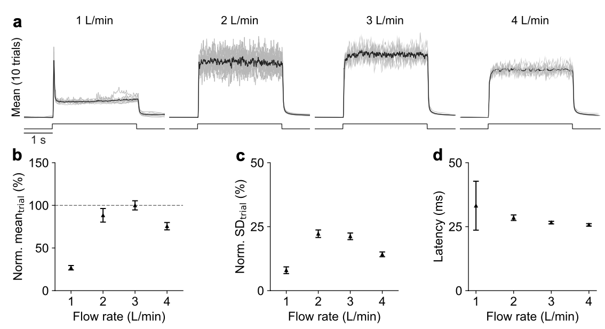
### Distance 
Varying distance between whiff canon 4000 tip and test subject.
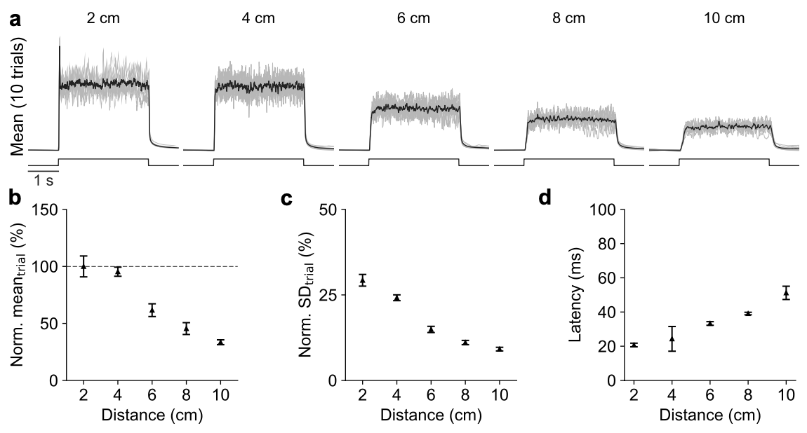
### Multiple valves 
Single trial plume visualisation using TiCl4, red box indicates distance of test subject.
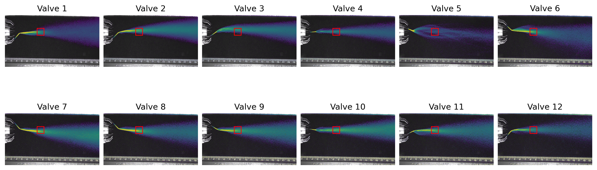
Mean PID recordings for each channel.
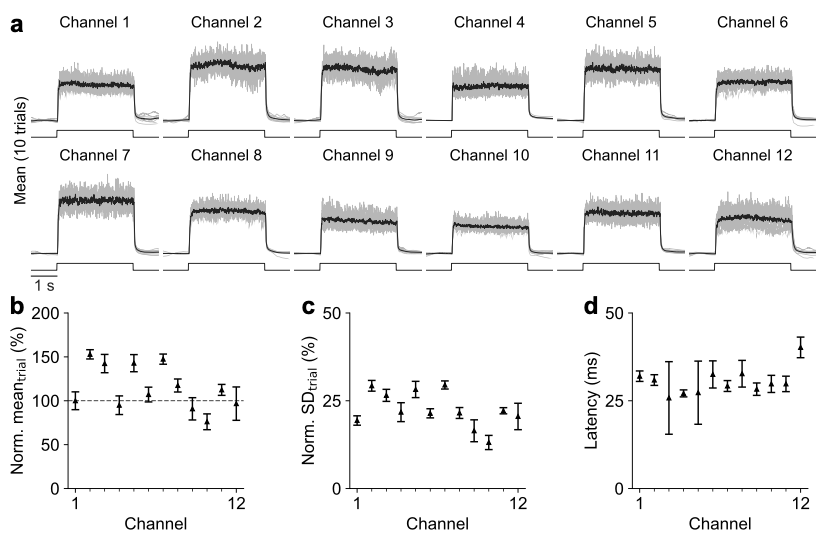

